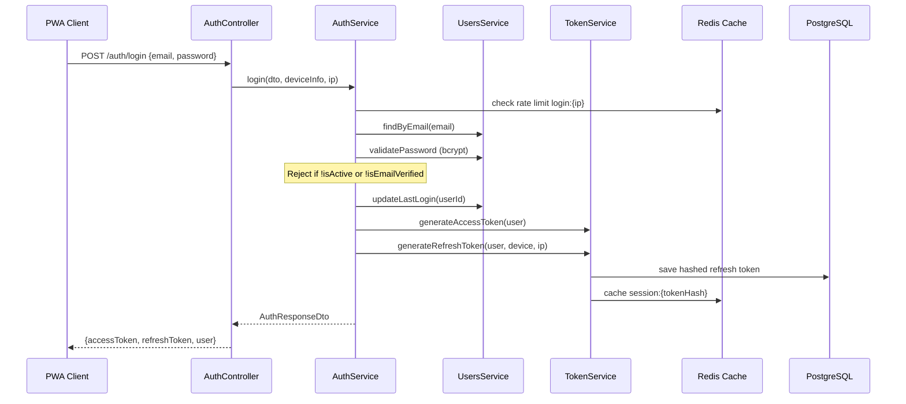
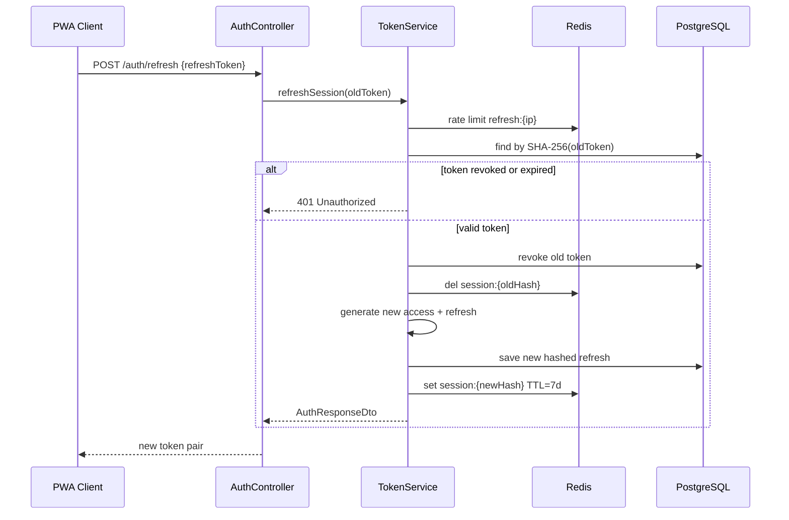
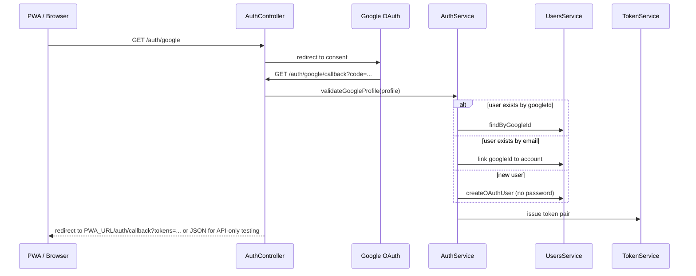

# Implementation Plan — Auth Features (Login, JWT, Refresh, Google OAuth)

**Author:** AI session plan  
**Date:** 2026-07-06  
**Base branch:** `develop`  
**Current working branch:** `feature/login` (has uncommitted TS fixes from prior session)

---

## 1. Executive Summary

The YegnaFinder backend already has ~70% of the auth foundation in place: registration, OTP verification, password reset, JWT module wiring, `JwtStrategy`, global `JwtAuthGuard`, `TokenService` (access + refresh generation/rotation/revocation), and a `RefreshToken` PostgreSQL entity. **What is missing is wiring and endpoints** — login, refresh/logout, protected route examples, Redis session acceleration, and Google OAuth from scratch.

This plan delivers **four incremental PRs** into `develop`, one per feature branch, following PWA-first constraints (stateless Bearer tokens, refresh rotation, Redis-backed session tracking).

---

## 2. Current State Analysis

### 2.1 What exists (complete)

| Component | Location | Status |
|-----------|----------|--------|
| User entity + roles | `src/users/entities/user.entity.ts` | Complete |
| Registration + OTP | `src/auth/services/auth.service.ts`, `otp.service.ts` | Complete |
| Password reset | `src/auth/auth.controller.ts` | Complete |
| JWT module + strategy | `src/auth/auth.module.ts`, `strategies/jwt.strategy.ts` | Complete |
| Global JWT guard | `src/common/guards/jwt-auth.guard.ts` | Complete, all routes protected unless `@Public()` |
| TokenService | `src/auth/services/token.service.ts` | Implemented but **not injected** into AuthService |
| RefreshToken entity | `src/auth/entities/refresh-token.entity.ts` | PostgreSQL, SHA-256 hashed opaque tokens |
| Redis (OTP only) | `src/auth/services/otp.service.ts` | Key pattern `otp:{type}:{email}` |
| AuthResponseDto | `src/auth/dto/auth-response.dto.ts` | Shape defined, no Swagger decorators |

### 2.2 What is missing

| Feature | Gap |
|---------|-----|
| **Login** | No `POST /auth/login`, no `LoginDto`, no credential validation, `lastLoginAt` never updated |
| **JWT Auth** | Infrastructure ready; no protected profile/me endpoint demonstrating `@CurrentUser()` |
| **Refresh** | No `POST /auth/refresh`, `logout`, `logout-all`; rotation does not return new access token |
| **Google OAuth** | No dependency, env vars, entity fields, strategy, or routes |

### 2.3 Config note

`JWT_REFRESH_SECRET` is validated at boot but **unused** — refresh tokens are opaque random bytes hashed in DB, not signed JWTs. Plan: remove from required validation (or mark optional) to avoid confusion.

---

## 3. Architecture Overview

### 3.1 Login flow



**PWA guidance:** Client stores `accessToken` in memory (or short-lived storage) and `refreshToken` in secure storage (IndexedDB via service worker cache strategy). No HTTP-only cookies — pure Bearer REST.

### 3.2 Refresh token rotation flow



**Theft detection:** If a revoked token is presented again, revoke the entire token family for that user (all active refresh tokens) and force re-login. This requires adding a `familyId` column to `RefreshToken`.

### 3.3 Google OAuth flow (redirect-based)



For production PWA: callback redirects to a configured `PWA_AUTH_CALLBACK_URL` with tokens in URL fragment (not query) to avoid server logs, or returns JSON when `Accept: application/json`.

---

## 4. Redis + PostgreSQL Strategy for Refresh Tokens

**Decision:** Hybrid storage (recommended for PWA security + performance).

| Layer | Responsibility |
|-------|----------------|
| **PostgreSQL** (`refresh_tokens` table) | Durable source of truth: hashed token, userId, familyId, deviceInfo, ipAddress, expiresAt, isRevoked. Supports audit trail and "logout all devices". |
| **Redis** | Hot session index: `session:{tokenHash}` → `{userId, familyId, deviceInfo}` with TTL = refresh expiry. Enables fast validation, rate limiting (`ratelimit:login:{ip}`, `ratelimit:refresh:{ip}`), and immediate family revocation via `family:revoked:{familyId}`. |

This satisfies the task requirement for **Redis-backed session tracking** while preserving the existing `RefreshToken` entity work. Pure-Redis-only storage would lose durable revoke-all across Redis restarts — not recommended for production PWAs.

---

## 5. Database / Entity Modifications

### 5.1 `RefreshToken` entity — add `familyId`

```typescript
@Column({ name: 'family_id', type: 'uuid' })
familyId: string;
```

Used for rotation chains and theft detection (revoke entire family on reuse).

### 5.2 `User` entity — OAuth fields

| Column | Type | Notes |
|--------|------|-------|
| `googleId` | `varchar(255)`, unique, nullable | Google `sub` claim |
| `authProvider` | enum (`local`, `google`) | Default `local` |
| `avatarUrl` | `varchar(500)`, nullable | From Google profile |
| `passwordHash` | **nullable** | OAuth-only users have no password |

### 5.3 New enum

`src/users/enums/auth-provider.enum.ts`:

```typescript
export enum AuthProvider {
  LOCAL = 'local',
  GOOGLE = 'google',
}
```

### 5.4 Migration

TypeORM `synchronize` is off in production. Plan includes a SQL migration file under `migrations/` (or documented manual ALTER statements for Sprint 1 dev with synchronize on).

---

## 6. Security Analysis

| Threat | Mitigation |
|--------|------------|
| **XSS stealing tokens** | Short-lived access tokens (15m); refresh rotation; PWA stores refresh in secure context; never log tokens; Swagger docs warn clients |
| **CSRF** | Stateless Bearer auth (no cookies) — CSRF not applicable to Authorization header pattern |
| **Replay (refresh token)** | One-time use rotation; old token revoked on refresh; reuse of revoked token → revoke entire family |
| **Token theft** | Opaque refresh tokens (80 hex chars); only SHA-256 hash stored; family revocation on suspicious reuse |
| **Brute force login** | Redis rate limit: 10 attempts / 15 min per IP + per email |
| **Email enumeration** | Login returns generic `401 Invalid credentials` for wrong email/password/unverified |
| **OAuth account takeover** | Link by verified Google email only; if local account exists with same email, require existing password or mark for manual link (plan: auto-link if email matches and Google email is verified) |
| **CORS misconfiguration** | Fix `origin: '*'` + `credentials: true` conflict in `main.ts` — use env `CORS_ORIGINS` comma-separated list |

---

## 7. Step-by-Step File Changes by Branch

### PR 1 — `feature/login` → `develop`

**Goal:** Credential validation and session initialization.

| File | Action |
|------|--------|
| `src/auth/dto/login.dto.ts` | **Create** — `email`, `password` with class-validator + Swagger |
| `src/auth/dto/auth-response.dto.ts` | **Update** — add `@ApiProperty` decorators |
| `src/auth/services/auth.service.ts` | **Update** — inject `TokenService`, add `login()` |
| `src/auth/auth.controller.ts` | **Update** — `POST /auth/login` returning `AuthResponseDto` |
| `src/users/users.service.ts` | **Update** — add `updateLastLogin(id: string)` |
| `src/auth/services/token.service.ts` | **Update** — add `issueTokenPair()` helper returning `AuthResponseDto` |
| `src/auth/services/session-cache.service.ts` | **Create** — Redis session cache wrapper |
| `src/auth/auth.module.ts` | **Update** — register `SessionCacheService` |

**Login business rules:**
1. Find user by email — generic 401 if not found
2. `user.validatePassword(password)` — generic 401 if invalid
3. Reject if `!user.isActive`
4. Reject if `!user.isEmailVerified` with `403 Email not verified`
5. Reject if `authProvider === GOOGLE` and no password set — `400 Use Google sign-in`
6. Update `lastLoginAt`
7. Return `{ accessToken, refreshToken, user: UserResponseDto }`

---

### PR 2 — `feature/jwt-auth` → `develop`

**Goal:** Demonstrate and harden JWT-protected routes (infrastructure mostly exists).

| File | Action |
|------|--------|
| `src/users/users.controller.ts` | **Create** — `GET /users/me` protected profile |
| `src/users/users.module.ts` | **Update** — register controller |
| `src/common/decorators/current-user.decorator.ts` | Verify usage (exists) |
| `src/auth/auth.controller.ts` | **Update** — `GET /auth/me` alias (optional, or users/me only) |
| `src/main.ts` | **Update** — fix CORS to use `CORS_ORIGINS` env var |
| `src/config/env.validation.ts` | **Update** — add optional `CORS_ORIGINS` |
| `.env.example` | **Update** — `CORS_ORIGINS=http://localhost:5173` |

**Protected route pattern:**
```typescript
@Get('me')
@ApiBearerAuth()
getProfile(@CurrentUser() user: User): UserResponseDto {
  return new UserResponseDto(user);
}
```

No changes to `JwtStrategy` or `JwtAuthGuard` expected — they are production-ready.

---

### PR 3 — `feature/refresh-token` → `develop`

**Goal:** Rotation, logout, logout-all, Redis session layer.

| File | Action |
|------|--------|
| `src/auth/dto/refresh-token.dto.ts` | **Create** — `refreshToken: string` |
| `src/auth/dto/logout.dto.ts` | **Create** — optional `refreshToken` for single-device logout |
| `src/auth/entities/refresh-token.entity.ts` | **Update** — add `familyId` column |
| `src/auth/services/session-cache.service.ts` | **Expand** — family revocation, rate limiting |
| `src/auth/services/token.service.ts` | **Update** — `refreshSession()`, `revokeToken()`, `revokeAllUserTokens()` + Redis sync; rotation returns access + refresh |
| `src/auth/services/auth.service.ts` | **Update** — `refresh()`, `logout()`, `logoutAllDevices()` |
| `src/auth/auth.controller.ts` | **Update** — `POST refresh`, `POST logout`, `POST logout-all` |
| `src/config/env.validation.ts` | **Update** — make `JWT_REFRESH_SECRET` optional |
| `migrations/XXXX-add-family-id.sql` | **Create** — schema migration |

**Endpoints:**

| Method | Path | Auth | Description |
|--------|------|------|-------------|
| POST | `/auth/refresh` | Public | Rotate refresh token, return new pair |
| POST | `/auth/logout` | Public | Revoke single refresh token |
| POST | `/auth/logout-all` | Bearer | Revoke all user refresh tokens |

---

### PR 4 — `feature/social-login` → `develop`

**Goal:** Google OAuth2 with auto-registration and account linking.

| File | Action |
|------|--------|
| `package.json` | Add `passport-google-oauth20`, `@types/passport-google-oauth20` |
| `src/users/enums/auth-provider.enum.ts` | **Create** |
| `src/users/entities/user.entity.ts` | **Update** — OAuth fields, nullable password |
| `src/users/users.service.ts` | **Update** — `findByGoogleId()`, `createOAuthUser()`, `linkGoogleAccount()` |
| `src/auth/strategies/google.strategy.ts` | **Create** |
| `src/auth/guards/google-auth.guard.ts` | **Create** (optional thin wrapper) |
| `src/auth/services/auth.service.ts` | **Update** — `googleLogin(profile)` |
| `src/auth/auth.controller.ts` | **Update** — `GET /auth/google`, `GET /auth/google/callback` |
| `src/auth/auth.module.ts` | **Update** — register `GoogleStrategy` |
| `src/config/env.validation.ts` | **Update** — Google env vars |
| `.env.example` | **Update** — `GOOGLE_CLIENT_ID`, `GOOGLE_CLIENT_SECRET`, `GOOGLE_CALLBACK_URL`, `PWA_AUTH_CALLBACK_URL` |
| `migrations/XXXX-add-oauth-fields.sql` | **Create** |

**OAuth business rules:**
1. New Google user → create with `authProvider: google`, `isEmailVerified: true`, random first/last from profile
2. Existing user with matching `googleId` → login
3. Existing local user with matching verified Google email → link `googleId`, login
4. Issue same `AuthResponseDto` token pair as login

---

## 8. API Contract Summary

### `POST /api/v1/auth/login`

**Request:**
```json
{ "email": "user@example.com", "password": "Password123!" }
```

**Response (200):**
```json
{
  "accessToken": "eyJhbG...",
  "refreshToken": "a1b2c3...",
  "user": { "id": "...", "email": "...", "role": "customer", ... }
}
```

### `POST /api/v1/auth/refresh`

**Request:** `{ "refreshToken": "..." }`  
**Response:** Same as login (new token pair).

### `POST /api/v1/auth/logout`

**Request:** `{ "refreshToken": "..." }`  
**Response:** `{ "message": "Logged out successfully" }`

### `POST /api/v1/auth/logout-all`

**Headers:** `Authorization: Bearer <accessToken>`  
**Response:** `{ "message": "Logged out from all devices" }`

### `GET /api/v1/auth/google` → redirect  
### `GET /api/v1/auth/google/callback` → redirect to PWA or JSON tokens

---

## 9. Testing Plan (per PR)

### PR 1 — Login
1. Register + verify OTP for test user
2. `POST /auth/login` with valid credentials → 200 + tokens
3. Wrong password → 401
4. Unverified email → 403
5. Confirm `lastLoginAt` updated in DB

### PR 2 — JWT Auth
1. `GET /users/me` without token → 401
2. `GET /users/me` with valid access token → 200 + user profile
3. Expired access token → 401

### PR 3 — Refresh
1. Login → save refresh token
2. `POST /auth/refresh` → new pair; old refresh fails on reuse
3. Present old (revoked) refresh again → 401 + all family tokens revoked
4. `POST /auth/logout` → refresh no longer works
5. `POST /auth/logout-all` with access token → all sessions dead

### PR 4 — Google OAuth
1. Configure Google Cloud OAuth credentials
2. `GET /auth/google` → Google consent screen
3. Complete callback → user created or linked, tokens issued
4. Repeat login with same Google account → same user

---

## 10. Execution Tracker

Upon approval, execution will maintain:

| Artifact | Purpose |
|----------|---------|
| `task.md` | Live checklist per branch/PR |
| `walkthrough.md` | Post-implementation guide with curl examples and env setup |

---

## 11. Open Questions for Approval

1. **Redis hybrid vs pure Redis for refresh tokens** — Plan uses PostgreSQL (durable) + Redis (fast session/rate-limit). Confirm or request pure Redis.
2. **Google callback delivery** — Redirect to `PWA_AUTH_CALLBACK_URL` with URL fragment tokens vs JSON response for API testing. Plan supports both via env flag.
3. **Email verification gate on login** — Plan blocks login until `isEmailVerified`. Confirm strictness.
4. **Uncommitted changes on `feature/login`** — Prior TS fixes (import paths, JWT types, User↔RefreshToken relation) should be committed as part of PR 1 baseline. Confirm.
5. **Branch stacking** — PR 2/3/4 will branch from `develop` after each merge (sequential), or rebase feature branches on latest develop. Confirm sequential merge order.

---

## 12. Approval Required

**Please review this plan and reply with approval (or requested changes) before implementation begins.**

Suggested approval message: *"Approved — proceed with PR 1 on feature/login"* or note any changes to the open questions above.
